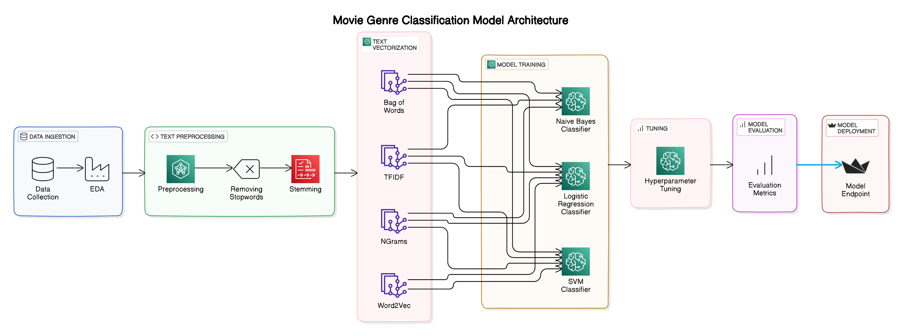

# Movie Genre Classification

## Project Overview

This project aims to classify movie genres using text data from the [Genre Classification Dataset from IMDb](https://www.kaggle.com/datasets/hijest/genre-classification-dataset-imdb). The goal is to build a robust model that can accurately predict the genre of a movie based on its plot summary.

## Architecture

## Table of Contents

1. [Dataset](#dataset)
2. [Data Assessment and Basic EDA](#data-assessment-and-basic-eda)
3. [Text Preprocessing](#text-preprocessing)
4. [Text Vectorization and Model Building](#text-vectorization-and-model-building)
5. [Results](#results)

## Dataset

The dataset used in this project is the [Genre Classification Dataset from IMDb](https://www.kaggle.com/datasets/hijest/genre-classification-dataset-imdb). This dataset contains movie plot summaries along with their corresponding genres. The dataset is diverse and covers a wide range of genres, making it suitable for building a multi-class classification model.

## Data Assessment and Basic EDA

Exploratory Data Analysis (EDA) was performed to understand the distribution of data, identify patterns, and uncover any anomalies. Key steps included visualizing the distribution of genres to understand the relationships between different features and the target variable.

## Text Preprocessing

Text preprocessing steps were applied to prepare the data for model building. These steps included:
- **Lowercasing**: Converting all text data to lowercase to ensure uniformity.
- **Removing Unnecessary Elements**: Cleaning the text by removing punctuation, special characters, and other irrelevant elements.
- **Removing Stopwords**: Filtering out common stopwords to reduce noise in the data.
- **Stemming**: Applying stemming to reduce words to their root forms, helping to standardize variations of words.

## Text Vectorization and Model Building

Various text vectorization techniques were applied to transform the text data into numerical features, followed by model training using different algorithms:
- **Text Vectorization**:
  - Bag of Words (BOW)
  - N-Grams
  - Term Frequency-Inverse Document Frequency (TFIDF)
  - Word2Vec

- **Model Building**:
  - Multinomial Naive Bayes (NB)
  - Logistic Regression
  - Support Vector Classifier (SVC)

Hyperparameter tuning was performed using GridSearchCV to optimize the models' performance.

## Results

The final results achieved on test data by the best-performing model are as:

- **Accuracy**: 58.23%

This metrics indicate the effectiveness of the model in classifying movie genres based on plot summaries.
