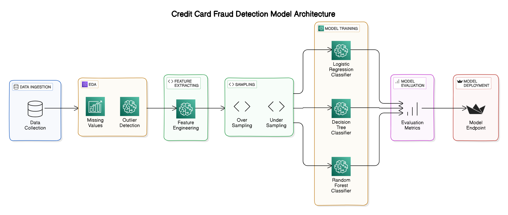

# Credit Card Fraud Detection

## Project Overview

This project aims to detect fraudulent credit card transactions using various machine learning techniques. The goal is to build a robust model that can accurately identify fraudulent activities and help in preventing financial losses. The project involves Exploratory Data Analysis (EDA), feature engineering, sampling techniques, and model training using logistic regression, decision tree, and random forest algorithms. Hyperparameter tuning was also performed to optimize the models.

## Architecture

## Table of Contents

1. [Dataset](#dataset)
2. [Exploratory Data Analysis](#exploratory-data-analysis)
3. [Feature Engineering](#feature-engineering)
4. [Sampling Techniques](#sampling-techniques)
5. [Model Training](#model-training)
7. [Results](#results)

## Dataset

The dataset used in this project is the [Kaggle Credit Card Fraud Detection dataset](https://www.kaggle.com/datasets/kartik2112/fraud-detection). This is a simulated credit card transaction dataset containing legitimate and fraud transactions from the duration 1st Jan 2019 - 31st Dec 2020. It covers credit cards of 1000 customers doing transactions with a pool of 800 merchants. we have 7506 frauds out of 1,296,675 transactions. The dataset is highly unbalanced.

## Exploratory Data Analysis

EDA was performed to understand the distribution of data, identify patterns, and uncover any anomalies. Key steps included visualizing the class distribution, transaction amount distribution, and correlation between features.

## Feature Engineering

Feature engineering involved creating new features and transforming existing ones to improve model performance. Techniques included scaling numerical features and encoding categorical features.

## Sampling Techniques

Given the imbalanced nature of the dataset, we applied SMOTE (Synthetic Minority Over-sampling Technique) to balance the class distribution.

## Model Training

Trained three different models to detect fraud:

1. **Logistic Regression**
2. **Decision Tree**
3. **Random Forest**

Hyperparameter tuning was performed using RandomizedSearchCV to find the optimal parameters for each model.

## Results

The final results achieved on test data by the models are as follows:

- **Macro Average:**
  - `Precision: 85.87%`
  - `Recall: 87.30%`
  - `F1 Score: 86.57%`

- **Legit:**
  - `Precision: 99.90%`
  - `Recall: 99.88%`
  - `F1 Score: 99.89%`

- **Fraud:**
  - `Precision: 71.85%`
  - `Recall: 74.73%`
  - `F1 Score: 73.26%`

Thank you for checking out our Credit Card Fraud Detection project! If you have any questions or feedback, please feel free to reach out.