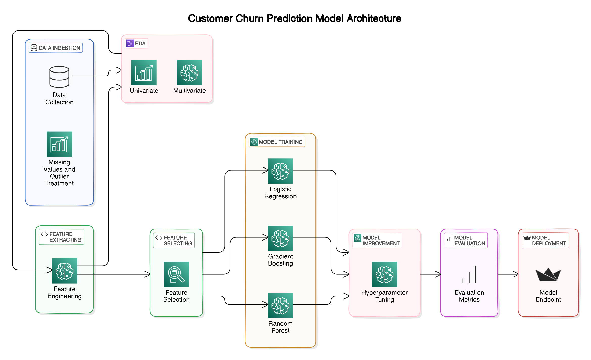

# Bank Customer Churn Prediction

## Project Overview

This project aims to predict customer churn in a bank using various machine learning techniques. The goal is to build a robust model that can accurately identify customers who are likely to leave the bank, helping the bank to take preventive measures. The project involves Exploratory Data Analysis (EDA), feature engineering, sampling techniques, and model training using logistic regression, gradient boosting, and random forest algorithms. Hyperparameter tuning was also performed to optimize the models.

## Architecture

## Table of Contents

1. [Dataset](#dataset)
2. [Exploratory Data Analysis](#exploratory-data-analysis)
3. [Feature Engineering](#feature-engineering)
4. [Sampling Techniques](#sampling-techniques)
5. [Model Training](#model-training)
7. [Results](#results)

## Dataset

The dataset used in this project is the [Kaggle Bank Customer Churn Prediction dataset](https://www.kaggle.com/datasets/shantanudhakadd/bank-customer-churn-prediction). It contains data about bank customers and whether they have churned or not. The dataset includes features such as customer age, tenure, account balance, and more.

## Exploratory Data Analysis

EDA was performed to understand the distribution of data, identify patterns, and uncover any anomalies. Key steps included visualizing the class distribution, examining correlations between features, and identifying outliers.

## Feature Engineering

Feature engineering involved creating new features and transforming existing ones to improve model performance. Techniques included scaling numerical features and encoding categorical features.

## Sampling Techniques

Given the imbalanced nature of the dataset, we applied SMOTE (Synthetic Minority Over-sampling Technique) to balance the class distribution.

## Model Training

We trained three different models to predict customer churn:

1. **Logistic Regression**
2. **Gradient Boosting**
3. **Random Forest**

Hyperparameter tuning was performed using GridSearchCV to find the optimal parameters for each model.

## Results

The final results achieved by the models on test data:

- **Random Forest:**
  - `Accuracy: 90.77%`
  
***Note: 90.77% accuracy on balanced data***

---

Thank you for checking out our Bank Customer Churn Prediction project! If you have any questions or feedback, please feel free to reach out.
