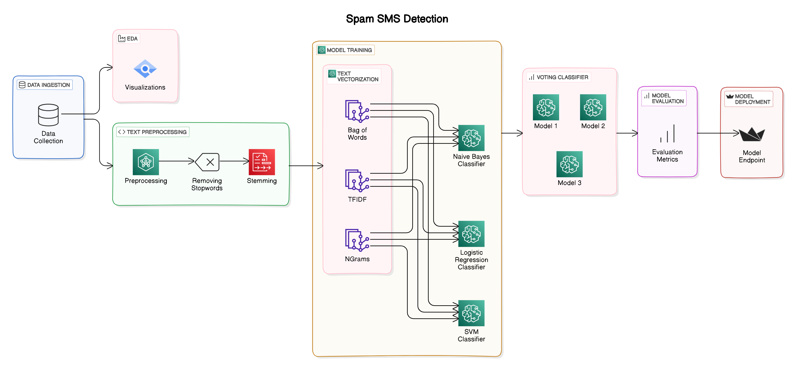

# SMS Spam Detection

## Project Overview

This project aims to classify SMS messages as spam or ham (not spam) using various machine learning techniques. The goal is to build a robust model that can accurately identify spam messages, thereby helping in filtering unwanted messages. The project involves text preprocessing, vectorization techniques, model training using Naive Bayes, Support Vector Classifier (SVC), Logistic Regression (LR) algorithms, and ensemble methods. Hyperparameter tuning and model evaluation were also performed to optimize the models.

## Architecture

## Table of Contents

1. [Dataset](#dataset)
2. [Text Preprocessing](#text-preprocessing)
3. [Feature Extraction](#feature-extraction)
4. [Model Training](#model-training)
5. [Ensemble Methods](#ensemble-methods)
6. [Results](#results)

## Dataset

The dataset used in this project is the [Kaggle SMS Spam Collection Dataset](https://www.kaggle.com/datasets/uciml/sms-spam-collection-dataset). It consists of SMS messages labeled as spam or ham. The dataset includes features such as message content and label (spam or ham).

## Text Preprocessing

Text preprocessing involved steps like lowercasing, removing special characters, removing stopwords, and stemming to clean and normalize the text data.

## Feature Extraction

Feature extraction included vectorization techniques such as TFIDF (Term Frequency-Inverse Document Frequency) and Bag-of-Words (BOW) to convert text data into numerical vectors suitable for machine learning models.

## Model Training

We trained several models to classify SMS messages:

1. **Naive Bayes**
2. **Support Vector Classifier (SVC)**
3. **Logistic Regression (LR)**

Each model was trained on the vectorized text data after preprocessing.

## Ensemble Methods

An ensemble voting classifier was used to combine predictions from multiple models, aiming to improve overall performance and robustness.

## Results

The final results achieved by the models on test data:

- **Ensemble Voting Classifier:**
  - `Accuracy: 97.96%`
  - `Precision: 98.43%`

---

Thank you for exploring our SMS Spam Collection Dataset Analysis project! Feel free to reach out with any questions or feedback.
